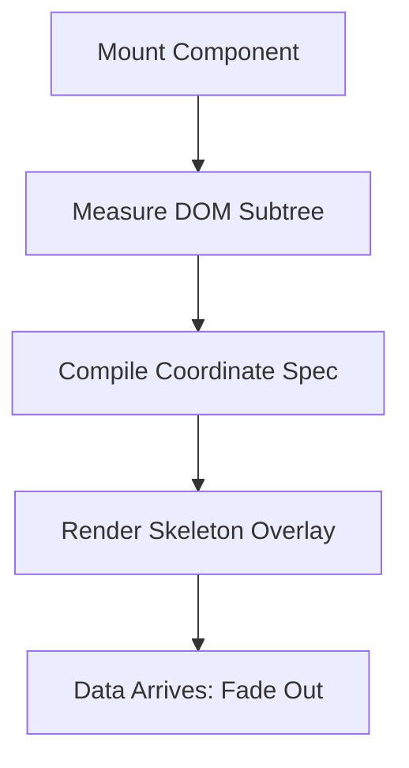

<div align="center">
  <h1>use-skelly</h1>
  <p>Skeletons that draw themselves — directly from your markup.</p>
  <p>
    <a href="https://github.com/sidhanshumonga/use-skelly/blob/main/LICENSE">
      
    </a>
    
    
  </p>
</div>

---

**use-skelly** is a zero-dependency, layout-driven skeleton loading library. Instead of writing custom skeleton components for every UI layout, Skelly measures your actual rendered HTML elements (avatars, text lines, images, tables, grid blocks) and compiles them into a pixel-accurate skeleton overlay at runtime or during server builds.

## 🚀 Key Advantages

* **Zero Configuration**: Wrap your component subtree and let Skelly derive the loader dimensions dynamically. No hand-rolling grey divs.
* **Zero Layout Shift (CLS)**: Skeletons occupy the exact dimensions of your real elements, guaranteeing layout transitions with zero jumps.
* **SSR & Streaming Ready**: Pre-compile route snapshots at build time to render skeleton loaders in the first byte of server HTML.
* **Responsive & Self-Healing**: Measures layout dimensions recursively at runtime, responding natively to viewport scaling.
* **Extremely Lightweight**: Core is only `2.1 kB` minified + gzipped; framework adapters are `~0.4 kB` each.

---

## ⚙️ How It Works (The Lifecycle)



### 1. Measure
Skelly recursively traverses your element tree, recording coordinates (`x`/`y`), bounds (`width`/`height`), `border-radius`, and element types (`text`, `image`, or generic structural `block`).

### 2. Compile
The measurements are translated into a compact JSON layout specification (around 100 bytes per component):

```json
[
  { "x": 0, "y": 10, "w": 380, "h": 22, "type": "block" },
  { "x": 0, "y": 42, "w": 240, "h": 14, "type": "block" },
  { "x": 0, "y": 74, "w": 44, "h": 44, "r": "50%", "type": "image" },
  { "x": 56, "y": 80, "w": "95%", "h": 10, "type": "text" },
  { "x": 56, "y": 98, "w": "88%", "h": 10, "type": "text" }
]
```

### 3. Render
While content is loading, the compiled specification renders as animated shimmers matching your design system.

---

## 📦 Installation & Setup

Install `use-skelly` from npm:

```bash
npm install use-skelly
```

Import core animation sheets at the root of your application (e.g. `layout.tsx` or `index.css`):

```css
import "use-skelly/style.css";
```

---

## 🛠️ Framework Integrations

### React / Next.js
```tsx
import { Skelly } from "use-skelly/react";

function Profile({ isLoading, data }) {
  return (
    <Skelly loading={isLoading} visual="shimmer">
      <div className="profile-card">
        
        <h2>{data.username}</h2>
        <p>{data.bio}</p>
      </div>
    </Skelly>
  );
}
```

### Vue 3
```html
<template>
  <!-- Custom directive implementation -->
  <div v-skelly="isLoading">
    <profile-card :user="data" />
  </div>
</template>

<script setup>
import { vSkelly } from 'use-skelly/vue';
</script>
```

### Svelte
```html
<script>
  import { skelly } from 'use-skelly/svelte';
  export let isLoading = true;
</script>

<div use:skelly={{ loading: isLoading }}>
  <slot />
</div>
```

### Vanilla JavaScript
```javascript
import { skelly } from 'use-skelly';

const element = document.querySelector('.profile-container');
const release = skelly(element, { visual: 'shimmer' });

// Call release() once content is fully fetched
release();
```

---

## 🎨 Visual Themes & CSS Variables

Style matching is done through CSS custom properties. Redefine these variables inside your stylesheet to support light, dark, or glassmorphic themes:

```css
:root {
  --skelly-base: #E4E2DC;       /* Base shape color */
  --skelly-highlight: #F5F4F0;  /* Animation sweep flash */
  --skelly-radius: 5px;         /* Default border-radius */
  --skelly-speed: 1.4s;         /* Shimmer/Pulse cycle speed */
}
```

### Visual Modes
* **`visual="shimmer"`**: GPU-composited gradient wave. Default.
* **`visual="pulse"`**: Calm opacity fade. Ideal for busy interfaces.
* **`visual="optimistic"`**: Renders skeleton bounds over text directly, reconciling on data load.
* **`visual="static"`**: Non-animated flat blocks. Respects `prefers-reduced-motion` settings.

---

## ⚡ Server-Side Rendering (SSR) & Snapshots

Pre-compile layouts to inline loading templates inside the first byte of your HTML response:

```javascript
// next.config.js
import { withSkelly } from 'use-skelly/next';

export default withSkelly({
  // skeleton specifications generated during build pipeline
});
```

---

## 📂 Project Monorepo Structure

* [`/packages/skelly`](file:///Users/sidhanshu/Github/use-skelly/packages/skelly): Main entry module containing Core, React, Vue, Svelte, Next, and CLI assets.
* [`/src`](file:///Users/sidhanshu/Github/use-skelly/src): Landing page, live benchmarks, and dynamic markdown documentation templates.

---

## 🤝 Contributing

We welcome community extensions and adapters (Preact, SolidJS, React Native)! Check out [`CONTRIBUTING.md`](file:///Users/sidhanshu/Github/use-skelly/CONTRIBUTING.md) to set up local environments and read contribution guidelines.

### Development commands:
```bash
npm install     # Install dependencies
npm run build   # Compile packages/skelly/src source
npm run dev     # Launch documentation website
```

License: MIT.
