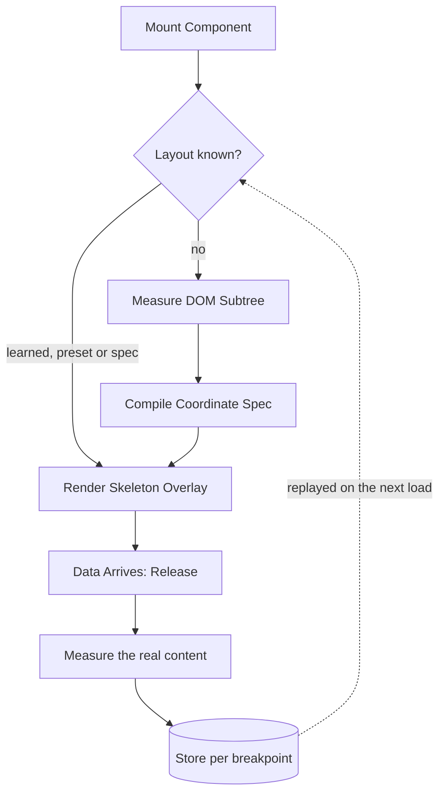

<div align="center">
  <h1>use-skelly</h1>
  <p>Skeleton screens that learn your UI — measured from your own markup.</p>
  <p>
    <a href="https://github.com/sidhanshumonga/use-skelly/blob/main/LICENSE">
      
    </a>
    
    
  </p>
</div>

---

**use-skelly** is a zero-dependency, layout-driven skeleton loading library. Instead of writing custom skeleton components for every UI layout, Skelly measures your actual rendered HTML elements (avatars, text lines, images, grid blocks) and compiles them into a pixel-accurate skeleton overlay — then remembers what it measured, so the next load paints your real layout instead of a guess.

## 🚀 Key Advantages

* **Zero configuration**: Wrap your component subtree and let Skelly derive the loader dimensions dynamically. No hand-rolling grey divs.
* **Minimal layout shift**: Placeholders are built from the real elements' geometry, so the swap from skeleton to content moves as little as possible.
* **Learns your layout**: Give a region a `name` and Skelly measures it once it renders, then replays that layout on later loads — no build step, nothing to regenerate.
* **Server renderable**: A `preset`, an explicit `spec`, or committed layouts render as real HTML, so a route fallback paints before any JavaScript runs.
* **Lightweight**: core `4.1 kB` min+gzip; React adapter `1.7 kB`, Vue `0.9 kB`, Svelte `0.6 kB`, stylesheet `0.6 kB`. Run `npm run size` to re-measure.

> **First load is generic.** A layout has to be seen before it can be replayed, so the very first visit falls back to a built-in shape unless you give it a `preset`, an explicit `spec`, or seed it with [`<SkellySpecs>`](#seeding-the-first-visit).

---

## ⚙️ How It Works (The Lifecycle)


```mermaid
graph TD
    A[Mount Component] --> B{Layout known?}
    B -->|learned, preset or spec| C[Render Skeleton Overlay]
    B -->|no| D[Measure DOM Subtree]
    D --> E[Compile Coordinate Spec]
    E --> C
    C --> F[Data Arrives: Release]
    F --> G[Measure the real content]
    G --> H[(Store per breakpoint)]
    H -.replayed on the next load.-> B
```

### 1. Measure
Skelly recursively traverses your element tree, recording coordinates (`x`/`y`), bounds (`width`/`height`), `border-radius`, and element types (`text`, `image`, structural `block`, or `surface`). Decoration is skipped rather than painted — see [`data-skelly-ignore`](#ignoring-decoration).

### 2. Compile
The measurements are translated into a compact JSON layout specification (around 100 bytes per component):

```json
[
  { "x": 0, "y": 10, "w": 380, "h": 22, "type": "block" },
  { "x": 0, "y": 42, "w": 240, "h": 14, "type": "block" },
  { "x": 0, "y": 74, "w": 44, "h": 44, "r": "50%", "type": "image" },
  { "x": 56, "y": 80, "w": "95%", "h": 10, "type": "text" },
  { "x": 56, "y": 98, "w": "88%", "h": 10, "type": "text" }
]
```

### 3. Render
While content is loading, the compiled specification renders as animated shimmers matching your design system.

### 4. Learn
Once the real content is on screen, Skelly measures it again and stores the result under its `name`, bucketed by viewport width. The next load of that layout starts at step 1 with the answer already in hand.

---

## 📦 Installation & Setup

Install `use-skelly` from npm:

```bash
npm install use-skelly
```

Import core animation sheets at the root of your application (e.g. `layout.tsx` or `index.css`):

```css
import "use-skelly/style.css";
```

---

## 🧠 Learned Skeletons

A measured skeleton is only available once the markup it measures has rendered — which is never the case at the moment you need it. The `name` prop closes that gap:

```tsx
<Skelly name="article-card" loading={isLoading}>
  <Article data={data} />
</Skelly>
```

* **1st load** — nothing learned yet, generic skeleton
* **2nd load** — your actual layout, measured from your own DOM
* **after an edit** — re-measured on the next render, so it cannot go stale

That last point is the argument against snapshotting at build time. A build artifact needs a headless browser, a CLI pass, and the discipline to re-run it whenever markup changes; when someone forgets, the skeleton is quietly wrong. A learned layout is overwritten by the next successful render.

### Breakpoints

Layouts are stored per viewport bucket — `[0, 480, 768, 1024, 1280, 1536]` by default — so a layout learned on a desktop is never replayed on a phone. Each width learns itself the first time someone visits at that size. Override with `breakpoints`:

```javascript
skelly(el, { name: "article-card", breakpoints: [0, 640, 1024] });
```

### Storage

Learned layouts live in `localStorage` under `skelly:learned:v2`, capped at 120 entries with the oldest evicted first. Nothing leaves the browser.

```javascript
skelly(el, { name: "card", storage: null });        // in memory for this page only
skelly(el, { name: "card", storage: sessionStorage }); // or any Storage-like object
```

### Seeding the first visit

Export what your browser learned, commit it, and render it from the server so new visitors get real skeletons too:

```javascript
import { exportLearnedSpecs } from "use-skelly";

copy(JSON.stringify(exportLearnedSpecs(), null, 2));
// -> { "article-card@1280": [ ... ], "article-card@768": [ ... ] }
```

```tsx
// app/layout.tsx
import { SkellySpecs } from "use-skelly/react";
import specs from "./skelly-specs.json";

export default function RootLayout({ children }) {
  return (
    <html><body>
      <SkellySpecs specs={specs}>{children}</SkellySpecs>
    </body></html>
  );
}
```

The layouts render on the server, so they are in the HTML, and each browser replaces them with its own measurements as it goes.

### Learning API

| Export | Purpose |
| --- | --- |
| `learnLayout(element, { name })` | Measure what is on screen now and store it |
| `recallSpec(name, options?)` | The layout learned for this name at this viewport, or `null` |
| `exportLearnedSpecs()` | Everything learned, as `{ "name@breakpoint": spec }` |
| `importLearnedSpecs(specs, options?)` | Merge exported layouts back in |
| `clearLearnedSpecs(options?)` | Drop every learned layout, in memory and storage |
| `breakpointFor(width, breakpoints?)` | The bucket a given viewport width falls into |
| `learnedKey(name, options?)` | The storage key for a name at the current viewport |

---

## 🛠️ Framework Integrations

### React / Next.js
```tsx
import { Skelly } from "use-skelly/react";

function Profile({ isLoading, data }) {
  return (
    <Skelly name="profile-card" loading={isLoading} visual="shimmer">
      <div className="profile-card">
        
        <h2>{data.username}</h2>
        <p>{data.bio}</p>
      </div>
    </Skelly>
  );
}
```

### Vue 3
```html
<template>
  <!-- Object form carries options; `v-skelly="isLoading"` still works -->
  <div v-skelly="{ loading: isLoading, name: 'profile-card' }">
    <profile-card :user="data" />
  </div>
</template>

<script setup>
import { vSkelly } from 'use-skelly/vue';
</script>
```

### Svelte
```html
<script>
  import { skelly } from 'use-skelly/svelte';
  export let isLoading = true;
</script>

<div use:skelly={{ loading: isLoading, name: 'profile-card' }}>
  <slot />
</div>
```

### Vanilla JavaScript
```javascript
import { skelly, learnLayout } from 'use-skelly';

const element = document.querySelector('.profile-container');
const release = skelly(element, { name: 'profile-card', visual: 'shimmer' });

// Once content is fetched and painted, drop the skeleton and learn the real layout.
release();
learnLayout(element, { name: 'profile-card' });
```

The React adapter calls `learnLayout` for you when `loading` goes false. In vanilla, Vue and Svelte you call it yourself at the point the real content is on screen.

---

## 🎨 Visual Themes & CSS Variables

Style matching is done through CSS custom properties. Redefine these variables inside your stylesheet to support light, dark, or glassmorphic themes:

```css
:root {
  --skelly-base: #E4E2DC;                      /* Base shape color */
  --skelly-highlight: #F5F4F0;                 /* Animation sweep flash */
  --skelly-radius: 5px;                        /* Default border-radius */
  --skelly-speed: 1.4s;                        /* Shimmer/Pulse cycle speed */
  --skelly-surface: rgba(28, 28, 26, 0.03);    /* structure: "surface" backing plate */
  --skelly-surface-border: rgba(28, 28, 26, 0.08);
  --skelly-optimistic: rgba(79, 70, 229, 0.16); /* visual: "optimistic" */
}
```

### Visual Modes
* **`visual="shimmer"`**: GPU-composited gradient wave. Default.
* **`visual="pulse"`**: Calm opacity fade. Ideal for busy interfaces.
* **`visual="optimistic"`**: Renders skeleton bounds over text directly, reconciling on data load.
* **`visual="static"`**: Non-animated flat blocks. Respects `prefers-reduced-motion` settings.

---

## 🧱 Structural Elements

A card, panel or section carries a background or border but exists to hold other things. `structure` decides what happens to it:

```javascript
skelly(el, { structure: "surface" });
```

* **`"leaves"`** (default): a structural parent containing measurable content emits nothing of its own, so the skeleton reads as its contents — the way you would hand-write it.
* **`"surface"`**: the parent is kept as a flat, unanimated backing plate behind its children, preserving the card outline. Style it with `--skelly-surface` and `--skelly-surface-border`.

### Ignoring decoration

Decoration is skipped rather than painted: anything blurred, and `aria-hidden` elements lifted out of flow with no text of their own — a background orb, a glow, a hairline ring. An `aria-hidden` icon sitting in flow beside a label is still content. For anything the heuristics miss:

```html
<div class="decorative-gradient" data-skelly-ignore></div>
```

---

## ⚡ Server-Side Rendering

A skeleton whose layout is known without touching the DOM renders on the server as real elements, so it ships in the initial HTML and paints before any JavaScript runs. Three cases qualify: an explicit `spec`, a `preset`, and a container with no children.

That is what makes `<Skelly>` usable as a Next.js route fallback:

```tsx
// app/dashboard/loading.tsx
import { Skelly } from "use-skelly/react";

export default function Loading() {
  return <Skelly preset="dashboard" visual="shimmer" />;
}
```

Presets: `dashboard` · `article` · `feed` · `profile` · `generic`.

A **measured** skeleton cannot be server rendered — measuring means reading geometry off real markup, and inside a `loading.tsx` the page it would measure has not rendered; the fallback renders instead of it. So wrap real children when the DOM exists, and reach for a preset, a compiled spec, or committed layouts when it does not:

```tsx
<Skelly name="profile" loading={isLoading}><ProfileCard user={data} /></Skelly>  // measured, client-side
<Skelly preset="profile" />                                                      // server rendered
```

To serve your *own* layouts on a first visit rather than a built-in preset, see [Seeding the first visit](#seeding-the-first-visit).

> `withSkelly()` from `use-skelly/next` is a thin Next.js config wrapper: it sets a `SKELLY_ENABLED` environment flag and passes your `webpack` function through. It does **not** compile or inline skeleton specs — server rendering is handled by the component itself, as above.

---

## 📂 Project Monorepo Structure

* [`/packages/skelly`](./packages/skelly): Main entry module containing Core, React, Vue, Svelte, Next, and CLI assets.
* [`/src`](./src): Landing page, live benchmarks, and dynamic markdown documentation templates.
* [`/test`](./test): Browser regression suite — `npm run test:browser`.

---

## 🤝 Contributing

We welcome community extensions and adapters (Preact, SolidJS, React Native)! Check out [`CONTRIBUTING.md`](./CONTRIBUTING.md) to set up local environments and read contribution guidelines.

### Development commands:
```bash
npm install          # Install dependencies
npm run build        # Compile packages/skelly/src, then build the site
npm run build:pkg    # Compile the library only
npm run dev          # Launch documentation website
npm run size         # Re-measure bundle sizes (min + gzip)
npm run test:browser # Serve the browser regression suite
```

License: MIT.
